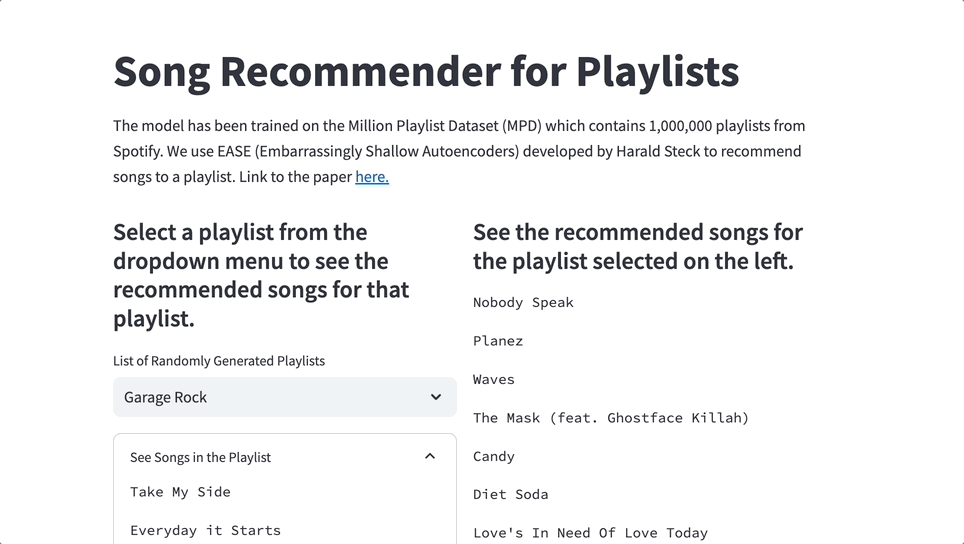

# Song Recommender for Playlists Using EASE

## Overview
This system recommends tracks for Spotify playlists using Embarrassingly Shallow Autoencoders for Sparse Data (EASE), trained on the Million Playlist Dataset (MPD). Links to the paper and dataset are provided below.

## Dataset
MPD includes 1,000,000 Spotify user-created playlists with titles, track lists, editing information, and other details.



## Installation
Required libraries:
- json
- csv
- pandas
- numpy
- os
- sys
- logging
- torch
- streamlit

## Data Preprocessing
The dataset is split into 1,000 slice files (`mpd.slice.0-999.json`). The script converts these files into Pandas DataFrames.

## Feature Engineering
Tracks in playlists are converted into a DataFrame. A utility matrix is built for the recommender system.

## Model Architecture
A Torch-based EASE model. It builds user and item lookup tables, creates a sparse data representation, and predicts track recommendations.

## Usage
1. Load data using `loadData`.
2. Select a playlist in Streamlit.
3. View recommendations.

## Example
```python
df = loadData('data/tracks_playlist_500.pkl')
res = loadData('data/res.pkl')
main()
```

## References
- [EASE Paper](https://arxiv.org/pdf/1905.03375.pdf)
- [Variational Autoencoders for Collaborative Filtering](https://arxiv.org/abs/1802.05814)
- [Spotify MPD](https://www.aicrowd.com/challenges/spotify-million-playlist-dataset-challenge)